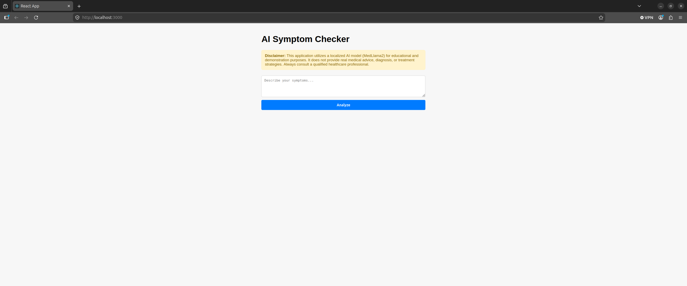

AI Symptom Checker

A privacy-first, full-stack medical symptom analysis application built using **Spring Boot**, **React**, and **Ollama**. This project leverages a localized **MedLlama2** LLM to evaluate user-submitted symptoms and provide potential conditions alongside a calculated urgency triage rating—ensuring **100% data confidentiality** by processing all healthcare inputs entirely on the local machine.

## 📺 System Demonstration
[ai-symptom-checker-demo.webm](https://github.com/user-attachments/assets/99fe20f3-6de7-4e26-8817-17f16e10c282)

## 🏗️ Architecture & Core Concepts

Instead of routing sensitive, private health information to third-party cloud APIs (like OpenAI or Anthropic), this application serves as a proof-of-concept for localized, compliance-focused AI operations.

[React Frontend] 
       │ (JSON Payload over HTTP POST)
       ▼
[Spring Boot Backend REST API]
       │ (Structured payload via Spring RestClient)
       ▼
[Ollama Local Engine (Port 11434)] ──► [MedLlama2 LLM Model (4-bit Quantized)]

# Key Technical Achievements:

* **Deterministic LLM Output:** Utilized Ollama's native `"format": "json"` API constraint to force a localized LLM to strictly comply with a structured JSON schema, entirely preventing model text bleeding or conversational filler.
* **Asynchronous UX Lifecycle:** Implemented state-synchronized loading barriers across the React component architecture, locking form controls and rendering active status indicators during local hardware token compilation.
* **Robust Fail-Safe Parsing:** Built a defensive serialization layer inside the Spring Service tier using Jackson's `ObjectMapper` to catch parsing exceptions gracefully, providing clean fallback states if local model generation encounters anomalies.

## 🛠️ Tech Stack

* **Backend:** Java 17, Spring Boot 3.x, Spring Web (`RestClient`, `@RestController`)
* **Build Tool:** Gradle
* **Frontend:** React (JavaScript, Hook-based State Architecture, Context-isolated Components)
* **AI Orchestration:** Ollama CLI Service
* **Local Model:** MedLlama2 (Medical-domain finetuned LLM)
* **OS Environment:** Ubuntu 26.04 LTS

## 🚀 Local Installation & Setup

### 1. Prerequisites (Local AI Infrastructure)

Install Ollama on your Linux environment and pull the medical model weights:

# Install Ollama engine
curl -fsSL https://ollama.com/install.sh | sh

# Download and initialize MedLlama2
ollama run medllama2

*Verify that the model service is listening natively on `http://localhost:11434`.*

### 2. Backend Configuration & Execution

Clone the repository, ensure your Java runtime environment is active, and launch via the Gradle wrapper:

cd symptom-checker-backend

# Build and run the Spring Boot app
./gradlew bootRun

The REST API will boot and register its endpoint mapping on port `8080`.

### 3. Frontend Setup

Navigate to the React directory, restore dependencies, and start the development server:

cd symptom-checker-frontend

# Install dependencies
npm install

# Launch the React dev server
npm start

Open `http://localhost:3000` in your browser to view the application interface.

## 🔌 API Specification

### Analyze Symptoms

* **URL:** `/api/symptoms`
* **Method:** `POST`
* **Headers:** `Content-Type: application/json`

#### Request Body

{
  "symptoms": "I have had a sharp pain in my lower right abdomen for 4 hours, along with slight nausea."
}

#### Response Body (200 OK)

{
  "conditions": [
    "Appendicitis",
    "Gastroenteritis"
  ],
  "urgency": "High"
}

## 🔒 Data Privacy & Compliance Design

In enterprise healthcare applications, data leaving the local local area network (LAN) poses strict HIPAA and compliance challenges. By demonstrating a functional pipeline that queries an internal `11434/api/generate` boundary:

1. **Zero Data Leakage:** Symptom text remains localized to system memory and local compute cores.
2. **Cost Efficiency:** Eliminates recurring token costs associated with proprietary cloud models.
3. **Offline Capability:** The system runs completely detached from the open internet, ideal for secure edge deployments or isolated hospital environments.
